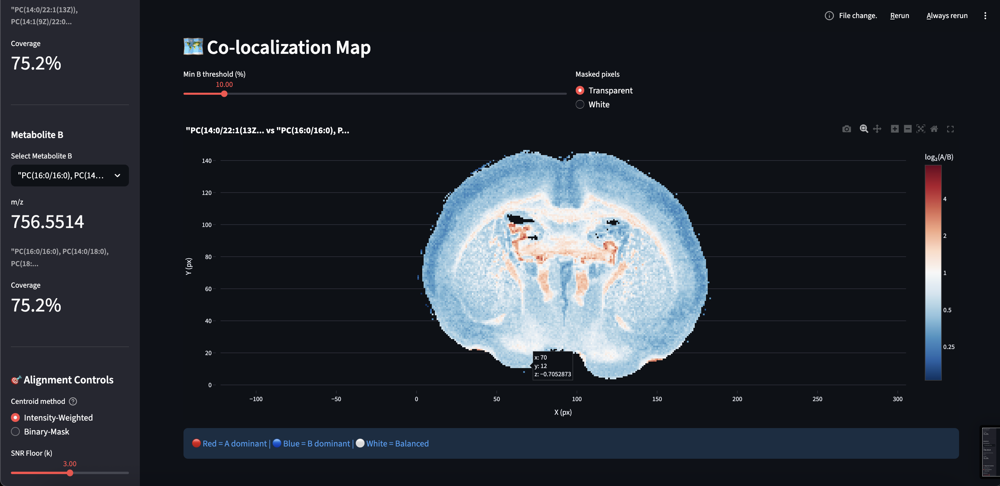
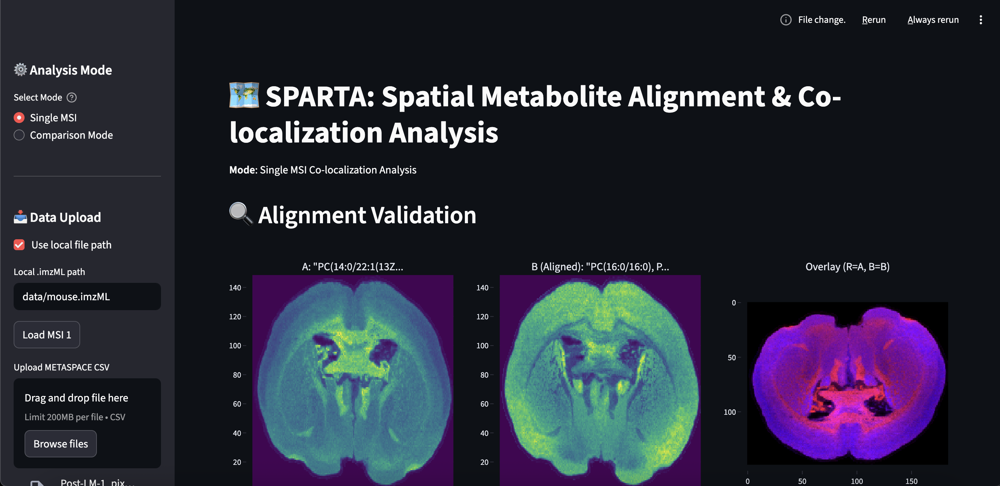
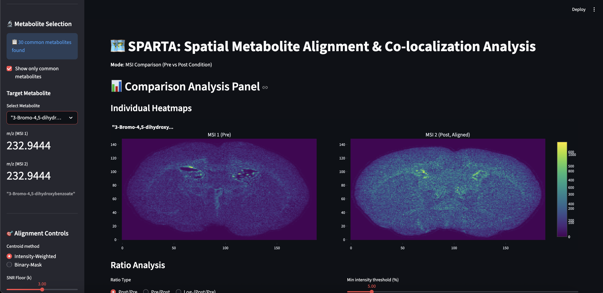
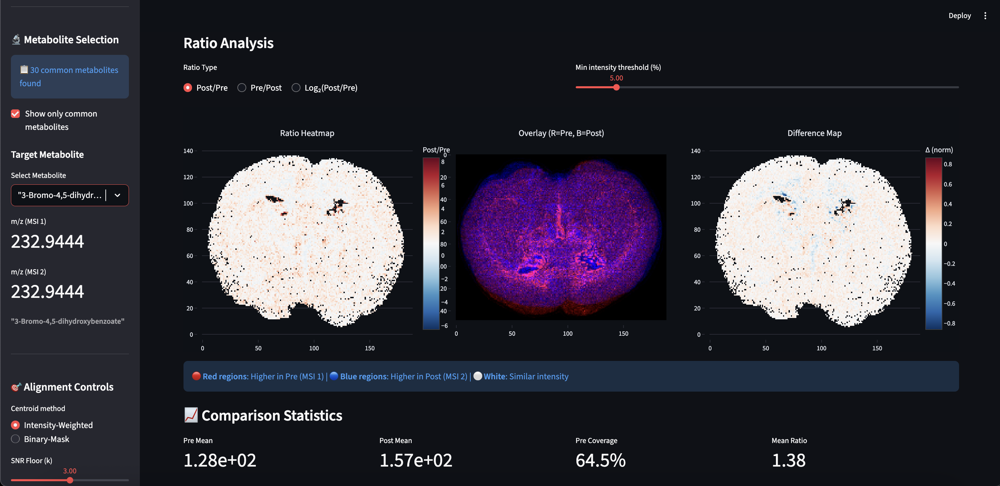
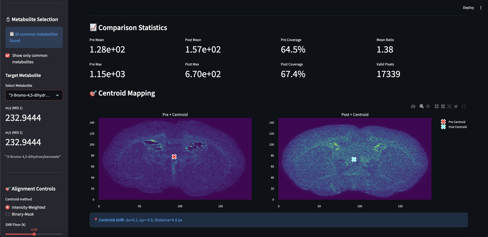

# SPARTA: Spatial Metabolite Alignment & Ratio Temperament Analysis

<p align="center">
  
</p>

**A production-ready Streamlit application for interactive spatial analysis of MALDI Mass Spectrometry Imaging (MSI) data, enabling researchers to validate metabolite distributions and discover spatial metabolic patterns.**

---

## The Science Behind SPARTA

### What is Mass Spectrometry Imaging (MSI)?

MALDI-MSI (Matrix-Assisted Laser Desorption/Ionization Mass Spectrometry Imaging) is a powerful technique that maps the spatial distribution of molecules across tissue sections. Unlike traditional mass spectrometry that homogenizes samples, MSI preserves the spatial context—allowing researchers to see *where* specific metabolites, lipids, or proteins are located within a tissue.

### Why Spatial Co-localization Matters

In cancer biology, metabolic reprogramming is a hallmark of tumor progression. Tumors alter their lipid composition, hijacking healthy tissue's metabolic machinery. By comparing the spatial distributions of different metabolites, researchers can:

- **Identify tumor boundaries** through metabolic "fronts" where healthy lipids give way to tumor-associated species
- **Validate METASPACE annotations** by checking if predicted adducts (H⁺, Na⁺, K⁺) share the same spatial pattern
- **Discover co-enrichment patterns** that reveal metabolic pathways operating in specific tissue regions

### The SPARTA Approach

SPARTA provides two complementary analysis modes:

1. **Single MSI Mode**: Compare two different metabolites within the same tissue section to reveal spatial co-localization patterns
2. **Comparison Mode**: Compare the *same* metabolite across two different conditions (e.g., pre-treatment vs. post-treatment, healthy vs. diseased)

---

## 🔬 Scientific Evolution & Development Pivots

Every major design decision in SPARTA was driven by the physics of the data and the need for biological reproducibility.

### 1. Proteomics → Metabolomics Pivot

| Decision | Shifted focus from intact protein identification to small molecule (lipid/metabolite) mapping |
|----------|----------------------------------------------------------------------------------------------|
| **Reason** | Analysis of the imzML spectral range revealed that the dataset's m/z range (typically 200–2000 Da) was naturally optimized for metabolites and lipids. Whole proteins typically exceed 10,000 Da. |
| **Impact** | Enabled use of **METASPACE (HMDB/KEGG)** annotations as a high-confidence validation anchor |

### 2. Discovery → Validation

| Decision | Implementation of spatial consistency checking across metabolite channels |
|----------|-------------------------------------------------------------------------|
| **Reason** | A single m/z peak can be a false positive due to isobaric interference. By requiring that a metabolite's spatial distribution is consistent with known biology, we increase identification confidence. |
| **Impact** | Transformed SPARTA from an exploratory tool into a validation platform |

### 3. Rigid Alignment Over Non-Rigid Warping

| Decision | Adopted **Centroid-Based Rigid Alignment** instead of AI-driven elastic warping |
|----------|---------------------------------------------------------------------------------|
| **Reason** | In clinical imaging, interpolation "hallucinates" data points. SPARTA prioritizes **data integrity**—by shifting center of mass and preserving raw pixel values, we ensure ratio maps are scientifically defensible. |
| **Impact** | Results are reproducible and clinically interpretable |

### 4. Functional Ratio Mapping ("Metabolic Switch")

| Decision | Pivoted from single-metabolite heatmaps to **Spatial Ratio Analysis (A/B maps)** |
|----------|---------------------------------------------------------------------------------|
| **Reason** | Raw intensity is biased by tissue thickness and matrix crystal density. Ratio maps are **self-normalizing** and reveal the "Metabolic Front"—boundaries where tumor metabolism differs from healthy tissue. |
| **Impact** | Enabled biologically meaningful comparisons across conditions |

---

## Demo Screenshots

### Single MSI Mode

**Alignment Validation Panel**
<p align="center">
  
</p>

*Side-by-side heatmaps of two metabolites with RGB overlay (Red=A, Blue=B). Purple regions indicate spatial overlap.*

**Co-localization Map**
<p align="center">
  
</p>

*Log₂ ratio map showing relative abundance. Red = Metabolite A dominant, Blue = Metabolite B dominant, White = balanced.*

### Comparison Mode (Pre/Post Analysis)

**Individual Heatmaps**
<p align="center">
  
</p>

*Same metabolite visualized across two different MSI datasets (e.g., different timepoints or conditions).*

**Ratio Analysis Panel**
<p align="center">
  
</p>

*Ratio heatmap (Post/Pre), RGB overlay, and difference map revealing spatial changes between conditions.*

**Statistics & Centroid Mapping**
<p align="center">
  
</p>

*Quantitative metrics and centroid positions showing spatial shifts in metabolite distribution.*

---

## Features

### Analysis Modes

- **Single MSI Mode**: Compare two metabolites within one tissue section
- **Comparison Mode**: Compare same metabolite across two MSIs (pre/post, healthy/diseased)

### Core Algorithms

| Module | Description |
|--------|-------------|
| **Dual-Mode Centroid** | Intensity-weighted (emphasizes hot spots) or Binary-mask (geometric center) |
| **SNR Floor Filtering** | `I_floor = μ_noise + k·σ_noise` removes background noise |
| **Rigid Shifting** | Integer pixel offsets with zero-padding (no interpolation artifacts) |
| **RGB Composite** | Per-channel normalization with optional co-enrichment visualization |
| **Ratio Mapping** | Pixel-wise A/B calculation with log₂ transformation |

### Interactive Controls

- **Auto-Align**: One-click centroid-based alignment
- **Manual Nudge**: ±1 pixel fine-tuning (⬅️⬆️⬇️➡️)
- **Threshold Adjustment**: Dynamic intensity cutoffs
- **Export**: Publication-ready CSV and PNG outputs

---

## Installation

### Prerequisites

- Python 3.8+
- pip package manager

### Setup

```bash
# Clone the repository
git clone https://github.com/yourusername/SPARTA.git
cd SPARTA

# Create virtual environment (recommended)
python -m venv venv
source venv/bin/activate  # Windows: venv\Scripts\activate

# Install dependencies
pip install -r requirements.txt
```

### Running the Application

```bash
streamlit run app.py
```

The application opens at `http://localhost:8501`.

---

## Quick Start

### Single MSI Mode

1. **Load Data**: Upload `.imzML` file or use local path (`data/mouse1.imzML`)
2. **Upload Annotations**: Load METASPACE CSV for metabolite selection
3. **Select Metabolites**: Choose Metabolite A and B from dropdowns
4. **Auto-Align**: Click "🔄 Auto-Align" to center distributions
5. **Visualize**: Explore co-localization map
6. **Export**: Download CSV/PNG results

### Comparison Mode

1. **Switch Mode**: Select "Comparison Mode" in sidebar
2. **Load MSI 1**: Upload first imzML + CSV (pre-condition)
3. **Load MSI 2**: Upload second imzML + CSV (post-condition)
4. **Select Metabolite**: Choose from common metabolites list
5. **Analyze**: View ratio heatmap, overlay, difference map
6. **Export**: Download comparison panel

See [QUICKSTART.md](QUICKSTART.md) for detailed workflows.

---

## Testing

```bash
# Run all tests
pytest tests/ -v

# Run with coverage
pytest tests/ --cov=backend --cov-report=html
```

### Test Coverage

- Centroid calculation (weighted/binary modes)
- Image shifting (all directions, wrap-around protection)
- RGB composite creation
- Co-localization map computation
- Heatmap reconstruction

---

## Project Structure

```
SPARTA/
├── app.py                    # Main Streamlit application
├── config.yaml               # Default parameters
├── requirements.txt          # Python dependencies
├── README.md                 # This file
├── QUICKSTART.md             # Quick start guide
├── backend/
│   ├── centroid_engine.py    # Centroid calculation
│   ├── shifter.py            # Rigid image shifting
│   ├── rgb_composite.py      # RGB overlay creation
│   ├── colocalization.py     # Co-localization computation
│   └── heatmap.py            # imzML heatmap reconstruction
├── tests/                    # Unit tests
├── data/                     # Example MSI datasets
│   ├── mouse1.imzML/.ibd     # Sample MSI 1
│   └── mouse2.imzML/.ibd     # Sample MSI 2
└── demo/                     # Screenshot demos
    ├── SingleMSI-panel-top.png
    ├── Single-MSI-colocalization.png
    ├── comparison-individual-heatmaps.png
    ├── comparison-ratio-analysis.png
    └── comparison-centroid-statistics.png
```

---

## Mathematical Foundations

### Centroid Calculation

**SNR Floor:**
$$I_{\text{floor}} = \mu_{\text{noise}} + k \cdot \sigma_{\text{noise}}$$

**Intensity-Weighted Centroid:**
$$\bar{x} = \frac{\sum_{x,y} x \cdot I(x,y)}{\sum_{x,y} I(x,y)}$$

### Co-localization Index

$$\text{Ratio}(x,y) = \frac{I_A(x,y)}{I_B(x,y)} \quad \text{where } I_B > I_{\min}$$

**Log₂ Transform** for symmetric visualization:
$$\text{Display} = \log_2(\text{Ratio})$$

---

## Future Directions

While SPARTA is currently a robust validation tool, these directions would expand its clinical utility:

### 1. 3D Structural Integration
Integrate a molecular viewer (e.g., `py3Dmol`) to show rotating structures alongside heatmaps—correlating molecular shape with tissue penetration.

### 2. Spatial Cross-Correlation
Statistical module to calculate **Pearson Correlation** between aligned maps, providing a single metric (0–1) for spatial overlap.

### 3. Automated ROI Analysis
Allow users to "lasso" tumor cores and automatically calculate region-specific spectra, comparing to healthy surrounding tissue.

### 4. Multi-Sample Batch Alignment
Expand centroid alignment to handle 5+ samples for time-series analysis of tumor progression or treatment response.

---

## References

### Scientific Background

1. Buchberger AR, et al. (2018). "Mass Spectrometry Imaging: A Review of Emerging Advancements and Future Insights." *Analytical Chemistry*. [PMC6533599](https://pmc.ncbi.nlm.nih.gov/articles/PMC6533599/)

2. Palmer A, et al. (2017). "FDR-controlled metabolite annotation for high-resolution imaging mass spectrometry." *Nature Methods*. [doi:10.1038/s41598-017-00703-w](https://www.nature.com/articles/s41598-017-00703-w)

3. Alexandrov T, et al. (2013). "MALDI imaging mass spectrometry: statistical data analysis and current computational challenges." *BMC Bioinformatics*. [PMC3857990](https://pmc.ncbi.nlm.nih.gov/articles/PMC3857990/)

### Datasets

Example datasets sourced from METASPACE:
- [Mouse Brain MSI - Session 1](https://metaspace2020.org/dataset/2025-06-22_13h55m04s)
- [Mouse Brain MSI - Session 2](https://metaspace2020.org/dataset/2025-06-22_13h57m51s)

*Note: Demo datasets represent different imaging sessions (proof-of-concept), not actual tumor vs. healthy tissue.*

---

## Acknowledgments

- **[PyImzML](https://github.com/alexandrovteam/pyimzML)** for imzML parsing
- **[METASPACE](https://metaspace2020.org/)** for metabolite annotations and public datasets
- **[Streamlit](https://streamlit.io/)** for the web framework
- **[Plotly](https://plotly.com/)** for interactive visualizations

---

## License

MIT License - See LICENSE file for details.

---